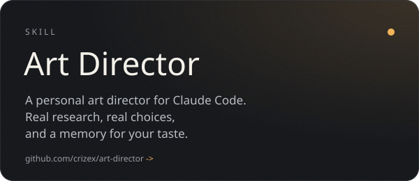
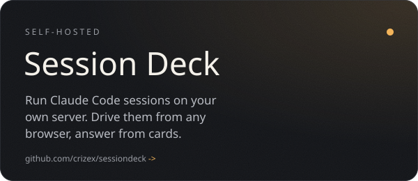
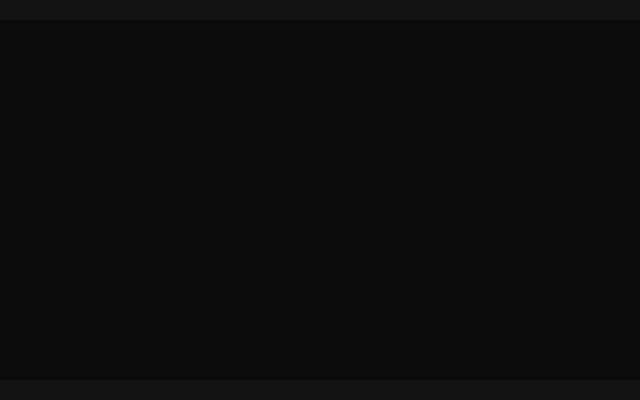
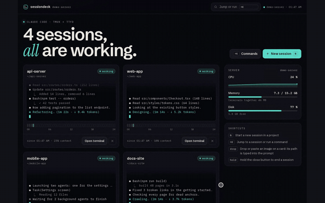
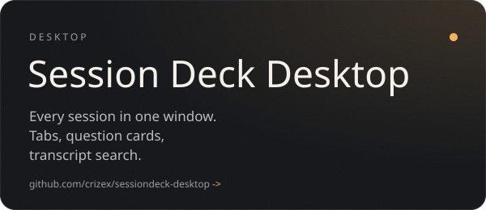
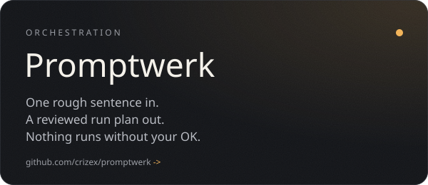
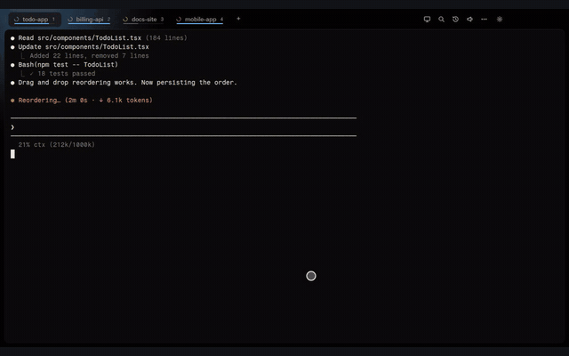
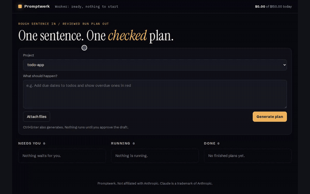

  

  I build the tools I want to use every day with Claude Code, 
  then strip them down to clean templates you can run yourself.

 

  
  
  
  

  
  
  
  

 

**How I build**

- **Taste over templates.** If it looks like every other AI-made page, it is not done yet.
- **Safe by default.** Auth on, localhost first, nothing irreversible without a human saying yes.
- **Ship what I use.** Everything here runs in my own daily setup before it becomes public.

**Latest releases**

<!-- releases:start -->
- `2026-10-01` [Art Director 1.4.0](https://github.com/crizex/art-director/releases/tag/v1.4.0)
- `2026-09-30` [sessiondeck 1.1.0](https://github.com/crizex/sessiondeck/releases/tag/v1.1.0)
- `2026-09-30` [SessionDeck Desktop 1.6.0](https://github.com/crizex/sessiondeck-desktop/releases/tag/v1.6.0)
- `2026-09-30` [Promptwerk 1.3.0](https://github.com/crizex/promptwerk/releases/tag/v1.3.0)
<!-- releases:end -->
